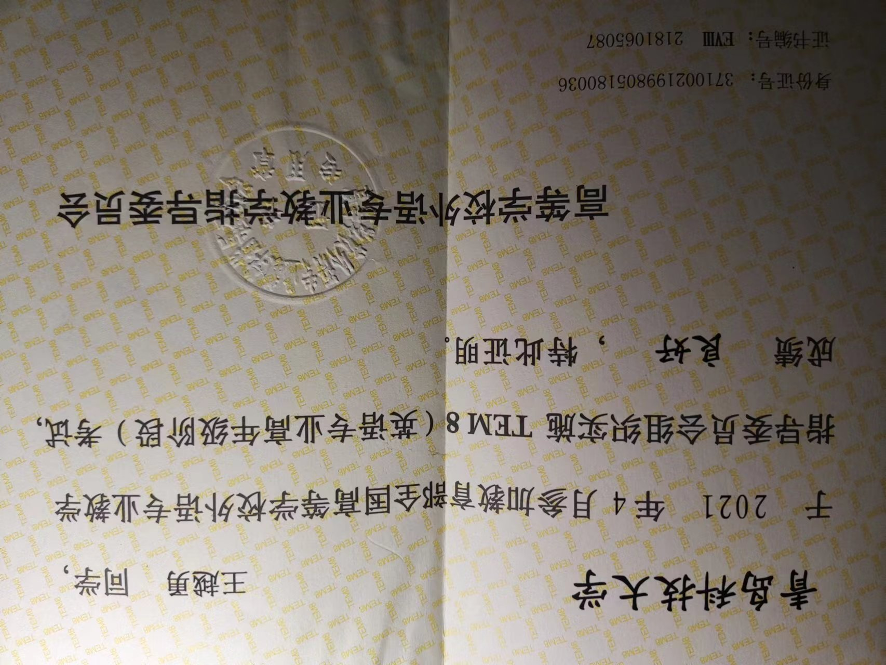

[TOC]

toc大写+[]

# 一、标题

ctrl+0=普通文本 ctrl+加号or减号，对标题级别进行加减

ctrl+1-6=1-6级标题

# ctrl+1=一级标题
## ctrl+2=二级标题
### 这是三级标题

# 二、段落

这是第一行

这是第二行

这是第一行
这是第二行，注意两种区别

# 三、分割线

---

***

三个-or*再按回车键，建议用减号，速度快

# 四、字体

粗体左右**两个乘号**=**文字**=ctrl+B

删除线左右两个波浪线=~~文字~~

斜体*左右一个乘号*=*文字*=ctrl+I

高亮左右两个等号==文字== 

<u>下划线</u><u>加上</u>=ctrl+U

***==这是一段文字==***

# 五、转义

1*2*3*4*5，发现*不显示，解决方法：添加\ 转义字符

1\*2\*3\*4\*5   

注意\\\*总共有三个\

# 六、上下标（一般简单的那种，不是数学的那种）

x^2^  左右一个^

H~2~O  左右一个波浪线

# 七、列表

1. 无序列表=减号/加号/乘号+空格
	1. 你是谁
	2. 一级分类
		- 二级分类
			- 三级分类
			- 三级分类
			- 三级分类

两次回车键退出编辑状态

一直按回车直到退出编辑状态or shift+tab=退格键

ctrl+左/右中括号可以改变级别

2. 有序列表=数字+点

	1. 你是谁

	2. bbbb

		- 此处利用了退格

			一个图片（此处直接按删除键就可以把圆圈去掉）

		- 你是谁

3. ccccc
	1. 你是哪位
		- 你是谁

任务列表

减号+空格=无序+[ ] 注意空格

- [ ] 

# 八、区块显示

大于号+回车键or空格

> aaa
>
> bbb
>
> ccc

> aaa

> bbb

#  九、代码显示

1. 行内代码=``

`int a=0;`

`你是谁`  可以选中然后在英文输入法状态下按``

`你是谁`  或者用ctrl+shift+``

2. 代码块=```

```text


```

```C++
可以直接```yuyan，这样C++就会自动出来
```

# 十、链接

www.baidu.com会自动识别

ctrl+按住网址会直接跳转

[百度一下](http://www.baidu.com)

[百度一下](http://www.baidu.com "http://www.baidu.com")这种会显示网址

还可以转移到文章内部[标题3](###这是三级标题)，注意此处#后面不能有空格

# 十一、脚注

文字[^1]

[^1]:这是说明aa<br>aaaaaaaaaaaaaaaaaaaaaaaaaaaaaaaaaaaaaaaaaaaa

如果内容分了两部分，想合成一部分，可以插入br，别忘了尖括号

# 十二、图片

跟链接类似，多了感叹号



# 十三、表格

ctrl+T

|                                |      |      |
| :----------------------------- | :--: | ---- |
| 第一行<br />第二行<br />第三行 |  2   |      |
|                                |      |      |
|                                |      |      |

aaaa

|      |      |      |
| ---- | ---- | ---- |
|      |      |      |
|      |      |      |
|      |      |      |

如何在两个表格中间添加内容，得用源代码模式

# 十四、表情符号

在编辑里面


